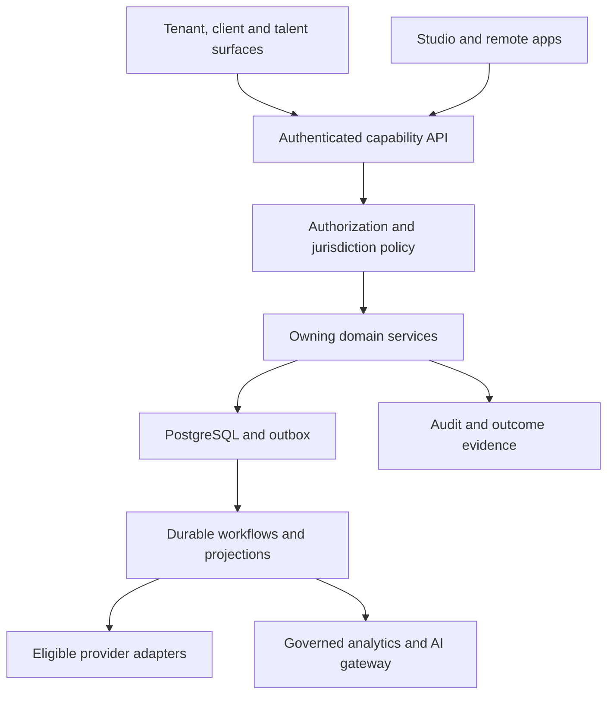
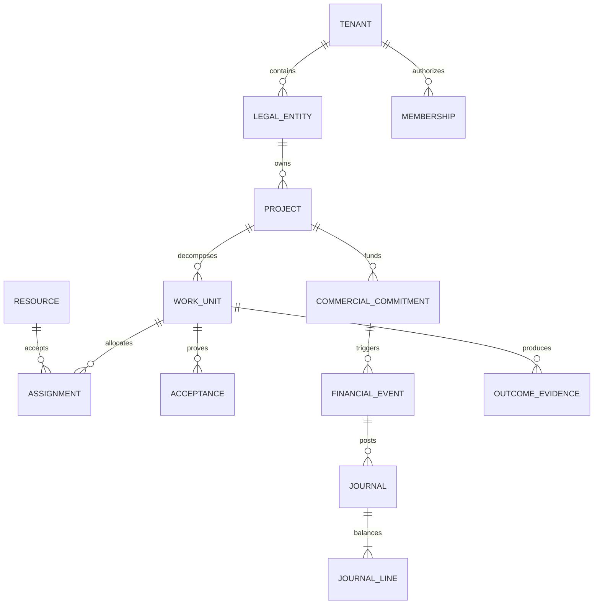

# Final architecture — V7.2

## System and deployment

One TypeScript modular monolith, Next.js role-based web surfaces, NestJS application/API, PostgreSQL authoritative transactions, Valkey expendable cache, Temporal behind WorkflowPort, S3-compatible object storage, OpenBao-compatible secret capabilities, OpenTelemetry. These are engineering selections, not a claim about installed or approved versions. Exact supported versions/digests/licenses are frozen in the M0.0 dependency inventory before installation. No Kubernetes, graph database or warehouse initially; extraction requires measured bottleneck/isolation evidence and ADR.

Web surfaces: tenant operations, client portal, talent/candidate portal, public intake/network, builder/developer console and separately authorized platform administration. Shared UI primitives do not imply shared permission. Public website renderer is isolated from authenticated business surfaces; custom domains must be verified and cannot decide tenant authorization.

Engineering control plane is a separate trust domain, account/budget/credential set and evidence store. It can operate without the product being built. Product AI cannot grant repository or deploy privileges. Building a product workflow engine is not a prerequisite to minimal engineering automation.

## Ownership and module contracts

| Owner module | Authoritative records | Exposes | Cannot own |
|---|---|---|---|
| Identity | minimal global subject, membership, sessions | actor authentication | tenant HR profile, app privilege |
| Organization | tenant/entity/branch/department/team hierarchy | scoped effective-dated organization | budget/financial postings |
| Policy | approved policy versions, decision envelopes, jurisdiction contexts | eligibility and obligations | legal opinions, arbitrary inferred law |
| Party/CRM | tenant party/contact/opportunity | approved client/provider references | network copy without opt-in |
| Catalog/Commercial | item/service/package/quote/contract/order | frozen commercial commitments | ledger balance |
| Work | goal/capability/work/task/acceptance/risk/issue/change | work commands, evidence | incident response or automatic payroll entitlement |
| Resource/People | capacity, availability, approved time, HR/engagement | scoped resource views | universal human score |
| Network/Trust | consented public projection, applications, disputes | eligible candidate pool | private HR/raw tenant learning |
| Finance | books/accounts/journals/AR/AP/periods/settlement/fixed-asset schedules | post/reverse/reconcile | AI arithmetic or Asset register as journal |
| Budget/Dimensions | budget plans/versions, cost/profit center assignments, commitments/variance | budget control and ledger-backed actual view | journal mutation or substitution for Ledger |
| Pricing | cost/rate/price policies, experiment snapshots | quoted scenarios | compensation or legal-floor override |
| Payroll/Compensation | approved employment rules/runs/payability | proposed payable events | final bank movement |
| Inventory/Fulfillment | reservations/movements/lot/serial/shipment, separate stocktake/valuation and order-dispute cases | typed physical transitions and independently reconciled COGS/settlement | safety-critical control or silent ledger edit |
| Knowledge/Interaction | documents/meetings/forms/conversations/notifications | ACL-aware content | grants from document text |
| Assets | asset register, ownership, renewal/warranty/dependencies | scoped metadata, reminders | secret value or physical EAM control |
| Secrets Vault | secret versions, scoped grants, rotation/revocation audit | short-lived capability invocation | general AI/browser/log plaintext exposure |
| Analytics/AI | metric/algorithm/decision registry, read models | recommendations with provenance | unrestricted production SQL |
| Studio/Extensions | schema/records, accessible forms/views, bounded rules/workflows, package/consent/installation | separately validated public capabilities and approvals | direct core table mutation |
| Subscription | plans/entitlements/usage/license/credit ledger | deterministic access grants | arbitrary plan strings in domains |
| Operations Incident | severity, impact, owner, timeline, communications, mitigation, resolution, postmortem | incident lifecycle and typed work/asset/ticket links | collapse risk/issue/ticket or expose restricted security case |
| Operations Recovery | backup/deploy/support diagnostic references, health/telemetry signal lifecycle | redacted correlated diagnostics/recovery | tenant data inspection or plaintext export by default |

Module owner means accountable engineering role, not a fabricated hired person. Before assigning production on-call, owner must name actual humans. One authoritative writer per aggregate. Domains may participate in a shared database transaction through a composed application service, but never write another module's tables directly. Cycle check on module dependency graph; public projection/query interfaces break read cycles. Outbox publishes only committed facts.

## Physical data boundaries

Module-specific schemas; normalized core tables. Tenant-owned tables carry tenant_id and entity_id where relevant; unique constraints and foreign keys include tenant_id to prevent cross-tenant references. UUID identifiers are not authorization. Runtime DB role is neither owner nor superuser and has no BYPASSRLS; FORCE RLS, deny when context absent. Separate migration role inaccessible to runtime/agents. Tenant context transaction-scoped, verified from membership, reset after pool use; do not trust request header alone. Explicit legal-entity grants are intersected with tenant grants.

Jobs, outbox/inbox, cache keys, blob metadata, signed download grants, search indexes, embeddings, analytics, exports and audit all carry tenant/ACL context. Every background consumer independently authorizes its capability. Cache keys include tenant/principal/purpose/policy epoch; invalidation on membership/consent/policy changes. Search filtering occurs before results, snippets, counts, facets and AI context. Revocation may not wait for reindexing: current permission check gates retrieval/download.

Shared Network is a separate opt-in projection of explicitly selected fields. It stores source provenance, consent version, expiry and revocation state. It never queries all private tenant HR tables. Membership in two tenants does not combine their records. Global identity contains only authentication identifiers and explicit links; tenant-owned contact/HR details stay separate. Dedicated/On-Prem use same contracts; outbound network connector exports only approved projection. No central database access.

## Domain relationships

All relationships above are tenant-compatible; cross-entity intercompany links are explicit paired transactions, not permission bypass. Resource subtypes preserve distinct human, team, asset, vendor and digital-worker semantics. Logical graph edges use relational IDs plus typed relationship tables; no free-form graph truth for money/identity.

## Runtime invariants and failure model

Command envelope: command_id, tenant_id, entity_id, actor_id/app_id, action, expected_aggregate_version, idempotency_key, payload_hash, jurisdiction_context_id, current_policy_epoch, correlation_id. Server derives actor/tenant and checks scope. Key scope is tenant+principal+capability; same key/different body => conflict. Successful retries return same result. Concurrency conflict => 409 with refresh path. Financial/payment keys retained at least as long as authoritative transaction retention.

Event envelope: event_id, tenant_id, entity_id, aggregate_type/id/version, event_type/schema_version, occurred_at/recorded_at, correlation/causation, classification, residency, policy_refs, minimal payload/reference. At-least-once delivery; transactional outbox and consumer inbox deduplicate. Ordering is aggregate-local, not global. Schema incompatibility => quarantine, observable dead-letter, bounded retry, owner. Replay rechecks present permissions and cannot repeat money movement. Projection rebuild is separate from side-effect replay.

WorkflowPort: start/signal/cancel/status/history; persistent versioned workflow and idempotent activities. Long waits store state. External outcomes can be pending/unknown; reconciler resolves using provider attempt/reference. Compensation is an explicit new business action, not an automatic rollback of reality. Approval binds action payload hash, amount/scope, actor, policy version, expiration; changes invalidate it. Before dispatch, re-evaluate eligibility and authority to avoid stale approval.

## Extensibility and global breadth

Typed kernel holds correctness. Approved JSON-schema-backed custom records hold tenant variability, namespaced by tenant/app/schema version; indexed projections for queries, referential validation for typed links. Studio expressions are deterministic, pure, bounded ASTs with no I/O, eval, shell or arbitrary language runtime. Country/industry/solution/tenant configuration composes through typed restrictive policy; legal conflict does not get solved by whichever pack loaded last.

Architecture now includes commerce/WMS/TMS, MRP/EAM/IoT, agriculture/food, CMS/eCommerce, workforce, digital twin, managed engagement and specialist regulated integrations. Their activation and proof differ; core banking, clinical EHR and industrial control require separately engineered/qualified systems. Ordinary specialized workflows remain possible through Studio or Remote Apps without Core forks.

## Nonfunctional design targets (not measured promises)

Initial benchmark profile: 100 tenants, 20 concurrently active users/tenant, 1M work records total, 10M journal lines total on declared test hardware. Small deployment profile: one tenant, 10 concurrent users, same correctness. Interactive non-AI read p95 <=500ms and command acceptance p95 <=1s excluding provider work; browser golden-flow LCP target <=2.5s under documented mobile/desktop test profile. Pagination max 100 default rows, export async and quota-limited. No global locks for ordinary tenant operations. Performance gate records dataset/hardware/version/concurrency, p50/p95/p99 and errors; hardware spending is not authorized by this target.

Internal operational SLO candidate: 99.5% monthly core availability; GA target 99.9% subject to measured architecture and owner-approved commercial SLA. RPO <=15min and RTO <=4h for managed transactional data are engineering targets; blobs/config/key recovery must meet documented compatible point. SLA contract never generated from these assumptions. Tenant isolation/ledger corruption has zero acceptable violations.

## Construction sequence

Documentation baseline -> protected repo/bootstrap -> reviewed M0.0 evidence -> exact-SHA M0.2 -> thin vertical golden loop -> strengthen outcome slices. No runnable product, migrations, CI or deployed system is included in this package. The dependency checklist is a future gate, not a request to install now.
